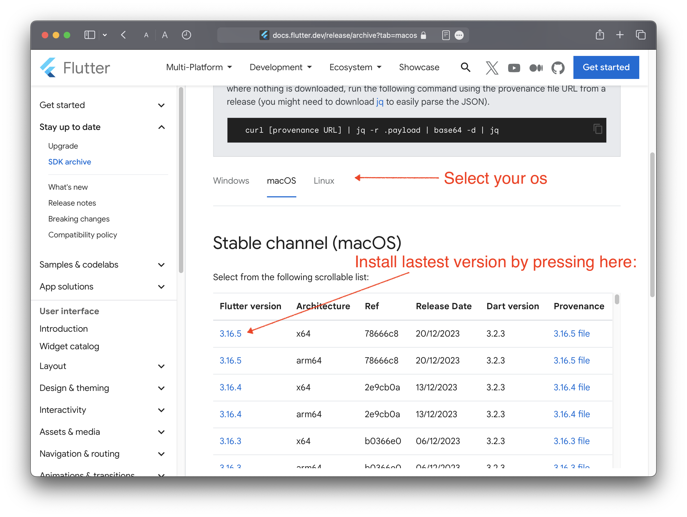
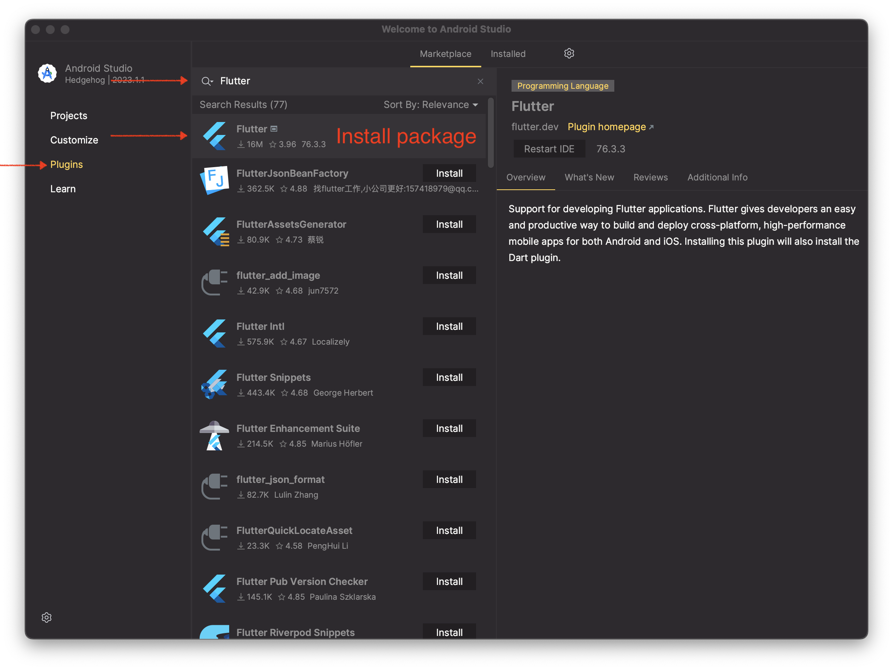
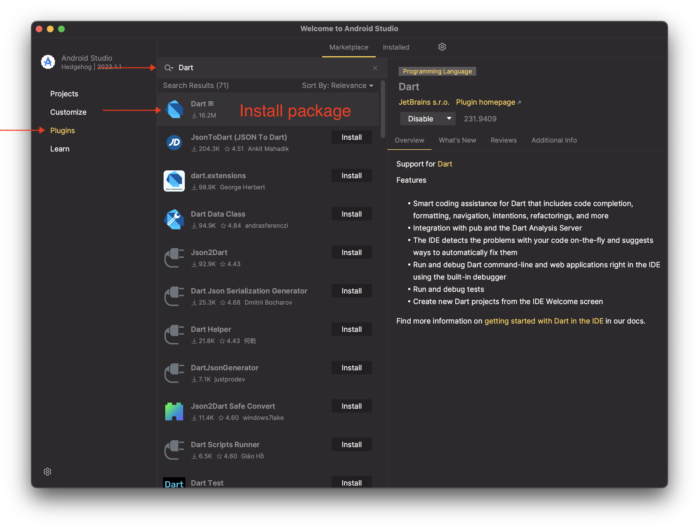
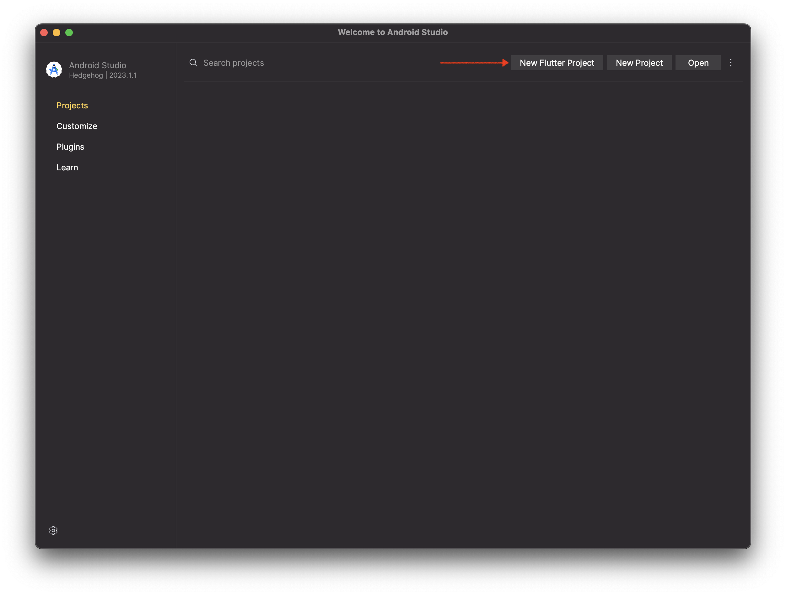
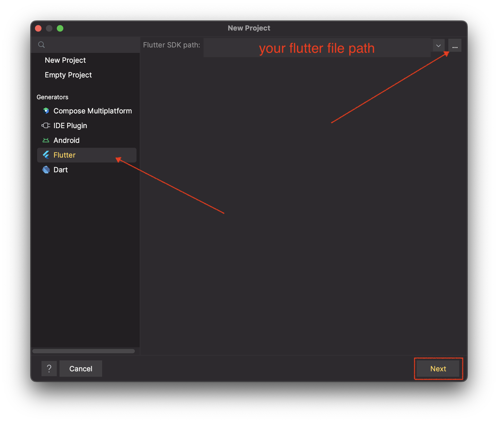
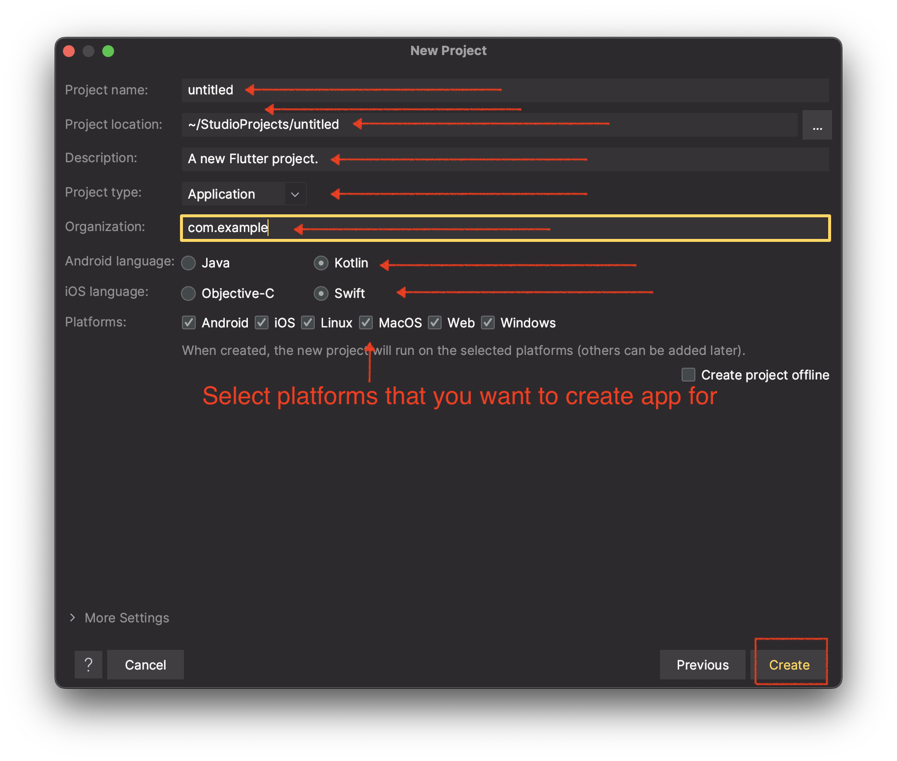
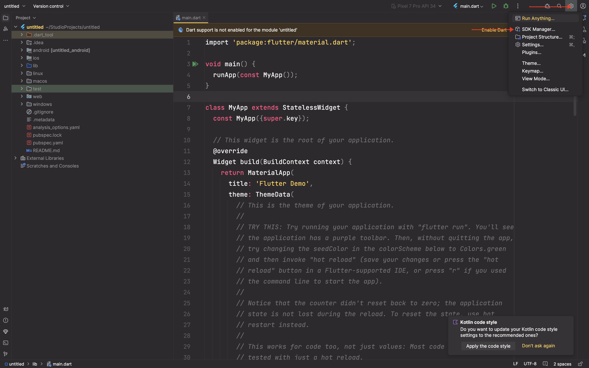
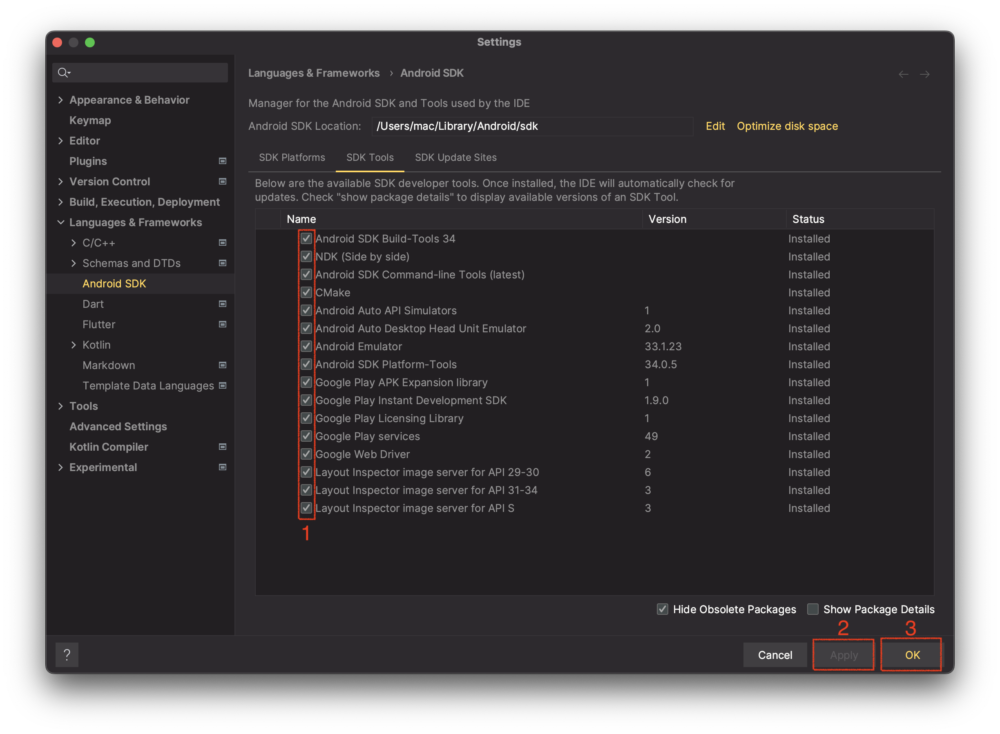
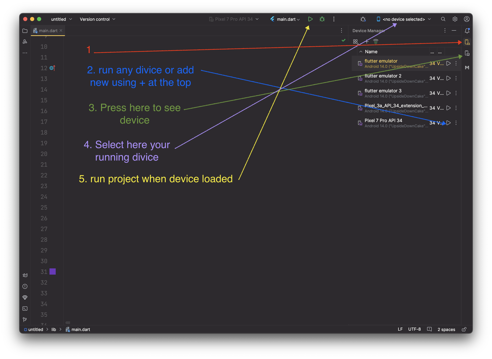

# Lets install and set up Android Studio!
## 1. We need to install Android Studio:
* <a href="https://redirector.gvt1.com/edgedl/android/studio/install/2023.1.1.26/android-studio-2023.1.1.26-windows.exe">Windows</a>
* <a href="https://redirector.gvt1.com/edgedl/android/studio/ide-zips/2023.1.1.26/android-studio-2023.1.1.26-linux.tar.gz">Linux</a>
* <a href="https://redirector.gvt1.com/edgedl/android/studio/install/2023.1.1.26/android-studio-2023.1.1.26-mac.dmg">Mac with Intel chip</a>
* <a href="https://redirector.gvt1.com/edgedl/android/studio/install/2023.1.1.26/android-studio-2023.1.1.26-mac_arm.dmg">Mac with Apple chip</a>
* <a href="https://developer.android.com/studio" target="_blank" rel="noopener noreferrer">If other links not working(official website)</a>
## 2. We need to install Flutter on your computer:
* <a href="https://docs.flutter.dev/release/archive?tab=windows" target="_blank" rel="noopener noreferrer">Crick here to go to official website</a>

On mac?

if you have intel you need to install x64 version

if you have Apple chip you need to install arm64 version

After downloading unpack file!

## 3. We need to install Dart and Flutter in Android Studio:

## Create first project

## 4. Restart Android studio
## 5. Create new flutter project:

## 6. Run project:

